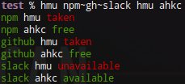

# hmu (hit me up)
> A tool all about information.

Hmu (hit me up) is a tool all about information.   Things like fetching name availability on GitHub, npm, and Slack; to getting the status of a server; listing twitter feeds; or even all of these at once...  Hmu uses plugins created by the community [that use the same API][hmu-plugin].  You can mix and match these plugins together at the same time [using hmu's cli features](docs/USING-CLI.md).



In order to use hmu, [you need to get plugins][plugins].  Also see [`awesome-hmu`][awesome-hmu] for a curated list of hmu plugins and utilities.

## Installation
```shell
$ npm install -g hmu
```

## Example Plugins
See [docs/GETTING-PLUGINS](docs/GETTING-PLUGINS.md) for more information, or [docs/WRITING-PLUGINS](docs/WRITING-PLUGINS.md) for instructions on how to create plugins.

You can install all of these to start off with hmu:
 - [`hmu-npm`][hmu-npm]: Check npm package name availability
 - [`hmu-gh`][hmu-gh]: Check GitHub user/organization name availability.
 - [`hmu-http`][hmu-http]: Check an HTTP server's status with GET requests.
```
$ npm install -g hmu-gh hmu-npm hmu-http
```

## Usage
```shell
$ hmu <plugin> [...arguments], [...]
```
See [docs/USING-CLI](docs/USING-CLI.md) for more information.

## Documentation
See the [`docs`](docs/) folder for information on how to use hmu, clone this repository to have it locally (offline).

## Credits
| ![jamen][avatar] |
|:---:|
| [Jamen Marzonie][github] |

  [avatar]: https://avatars.githubusercontent.com/u/6251703?v=3&s=125
  [github]: https://github.com/jamen
  [plugins]: https://www.npmjs.com/browse/keyword/hmu
  [hmu-npm]: https://github.com/devjs/hmu-npm
  [hmu-gh]: https://github.com/jamen/hmu-gh
  [hmu-http]: https://github.com/jamen/hmu-http
  [hmu-plugin]: https://github.com/jamen/hmu-plugin
  [awesome-hmu]: https://github.com/jamen/awesome-hmu
